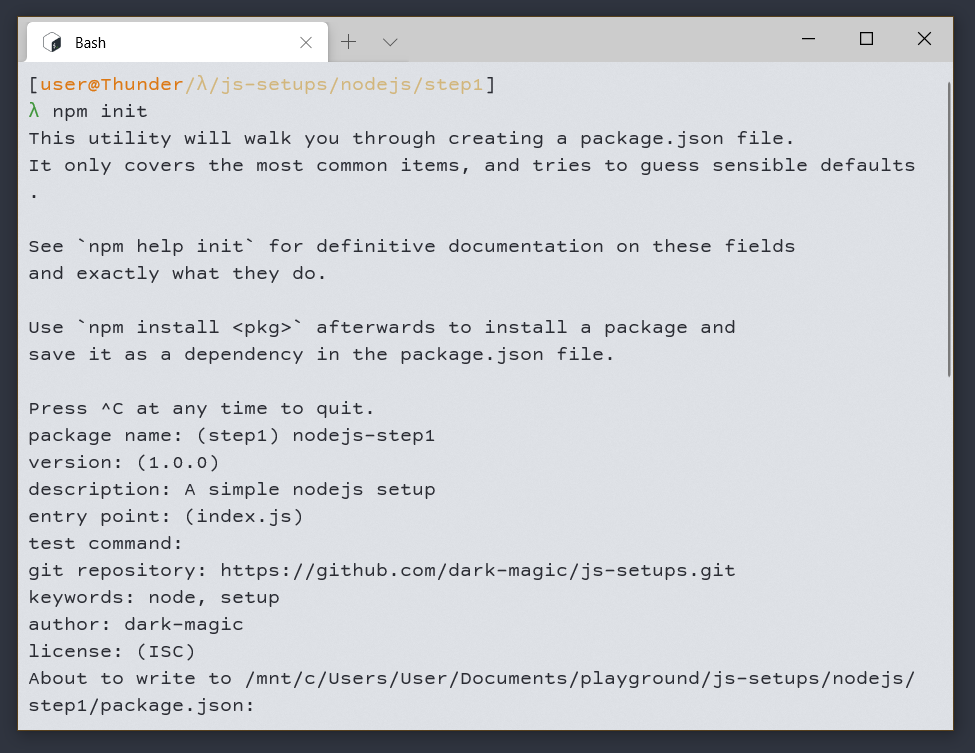
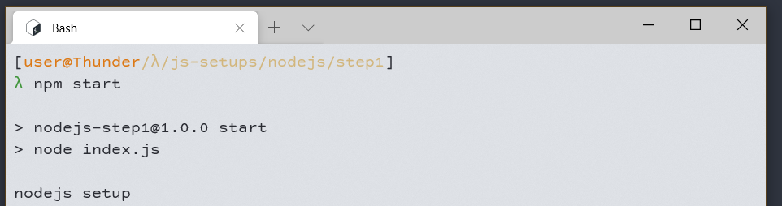
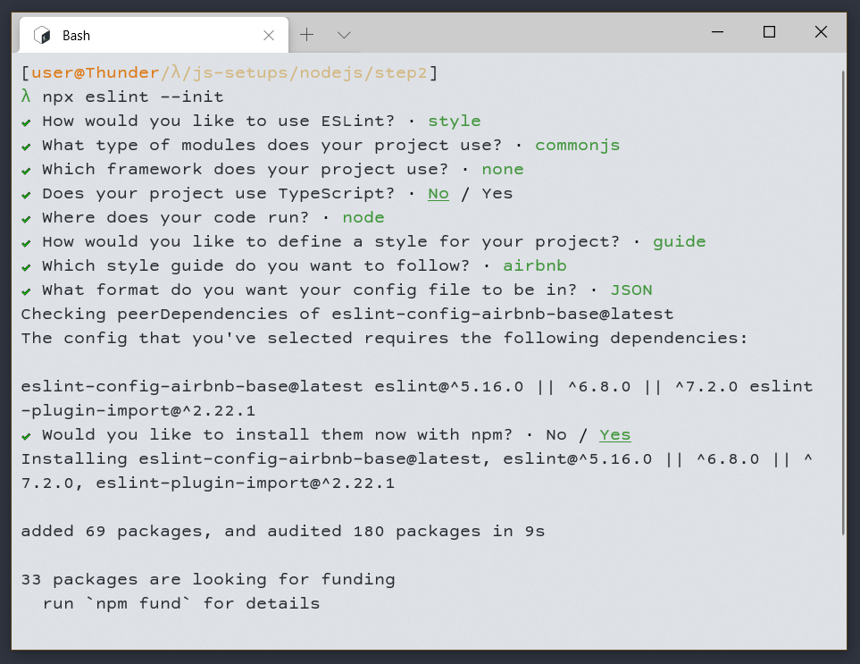
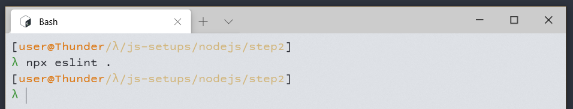
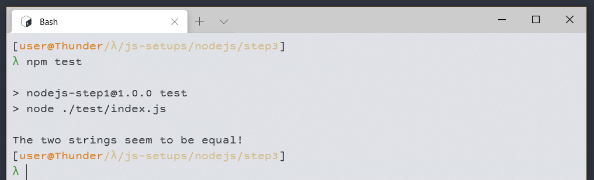

# Node Project Setup
It is assumed that you have created a project folder already and are inside it. If you haven't done 
so yet, do this before continuing with this setup. The aim of these setups is to be minimalistic
and understandable, and there exists a folder for each step with the project files like they were
after that step. Each step is a valid setup on its own, this means that you can quit at any given
time when you are happy with your setup. All code snippets start with a comment with the file name, 
no need to add them. These comments will for example **not work** in a json file, and 
**must be ommited**.

So, let's get started. For this project it is expected that node and npm are installed. 


## 1. Initialising npm
With any node project, one of the first things you want to do is `npm init`. This creates a 
`package.json` file which will contain a list with your dependencies, scripts, and other metadata.

It will ask you some questions about your projects and generate the `package.json`. To use a default
value (often shown in braces) for a field simply press enter.



Let's have a quick glance at the generated `package.json`.
- `name`, `version`, `description`, `keywords`, `author`, and `license` are just some metadata about 
  your project.
- `main`  contains the main file of your project aka the entry point of your app.
- `scripts` scripts should contain scripts which are executed frequently.
  - `test` contains a test command which simply prints an error and fails, since we didn't specify 
    which command to use for testing your project.
- If you specified a git repository you will see it added under `repository`. It might generated 
  some links for the `homepage` and `bugs` fields as well which point to your repository.

We see that npm expects a main file, `index.js` by default. Let's create it and put a log in it.
```js
// index.js
console.log('nodejs setup');
```

One more thing to do, and we've got a very minimal nodejs project set up. Remember the scripts in
`package.json`? It is best practice to add a `start` script which starts your application, like
this:
```json
// package.json
"scripts": {
  "start": "node index.js",
  "test": "echo \"Error: no test specified\" && exit 1"
}
```

The project is all set up now! you can run your project with `npm start` and should be able to see 
the text `nodejs setup` appearing in the console. 



*Note: When you name your script anything different than `start` or `test` you will need to 
run it with `npm run <script-name>` instead. `start` and `test` are used so often, that they got an
alias which does this behind the scenes.*

You can now use `npm install <package>` to install a package in the `node_modules` folder (auto 
generated by npm) and add it as a dependency to your `package.json`.

If you use git with your project make sure to add the `node_modules` to the `.gitignore`.
```sh
# .gitignore
node_modules
```


## 2. Adding eslint for code style checks
**Builts up on:** `step 1`

If you want to enforce a specific code style, eslint is a good tool to add to your project.
Let's start by installing it as a dev dependency with `npm install -D eslint`.

Before we can use eslint, we need to configure it. The easiest way to do this is by using 
`npx eslint --init`. It will ask you some question about your project and code style, and then
generates an `.eslintrc.EXT` which it thinks suits you best.



Let's have a quick glance on the init command and the generated file:
- For the module type you will probably want `commonjs` unless you are using es6 modules.
- When it asks where the code runs, you should use `<space>`/`<i>`/`<a>` to select the right option.
- For the code style, the `airbnb` one seems to be a good and popular base for the config.
- In the config you will see a `rules` field in which you can customise rules for the code style.

Since airbnb disallows the use of the console by default (intended for frontend js) but we want to
use it with node, let's disable that rule. I will also disable the `linebreak-style` rule since I 
work on a windows machine. The rules will look like this:
```json
// .eslintrc.json
"rules": {
  "no-console": "off",
  "linebreak-style": "off"
}
```

Now, to execute eslint on all files in this folder (ignores `node_modules` by default) we can do 
`npx eslint .`.



If there are any errors, they will be listed in the console so you can fix them. Else, it will 
simply run and succeed, like in this case.

It is a good idea to add this command to the npm scripts under `lint`, so you can run it with 
`npm run lint`.
```json
// package.json
"scripts": {
  "start": "node index.js",
  "lint": "eslint .",
  "test": "echo \"Error: no test specified\" && exit 1"
}
```

Eslint is now completely set up and you are good to go!


## 3. Adding tests
**Builts up on:** `step 1`

For bigger projects you will want to write tests. This step will show you a common project setup for
nodejs projects with tests.

First, let's create 2 folders. `src` for the app itself, and `test` for the tests for the app.
Then, move `index.js` into `src` and update the `package.json`.
```json
// package.json 
"main": "./src/index.js",
"scripts": {
  "start": "node ./src/index.js",
  "test": "echo \"Error: no test specified\" && exit 1"
}
```

Now we have a clean separation between the actual app and the tests. Let's add a very basic test
inside the `test` folder.
```js
// test/index.js
const assert = require('assert');

try {
  // actual, expected, error message
  assert.strictEqual('node setup', 'node setup', 'The two strings don\'t seem to be equal!');
  console.log('The two strings seem to be equal!');
}
catch (err) {
  console.error(err.message);
  process.exit(1); // return failing exit code since a test failed
}
```

This test uses the built in node assert library and simply checks if the 2 values are equal. You 
can, of course use any testing framework you like.

To finish it all up, let's add an actual `test` script to the `package.json` so we can use 
`npm test`.
```json
// package.json
"scripts": {
  "start": "node ./src/index.js",
  "test": "node ./test/index.js"
}
```

When everything works correctly we should see `The two strings seem to be equal!` in the console
when we run `npm test`.


